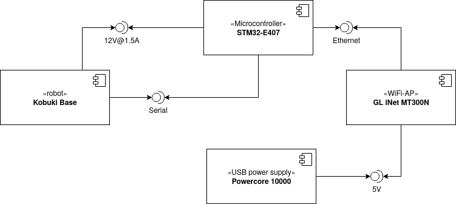
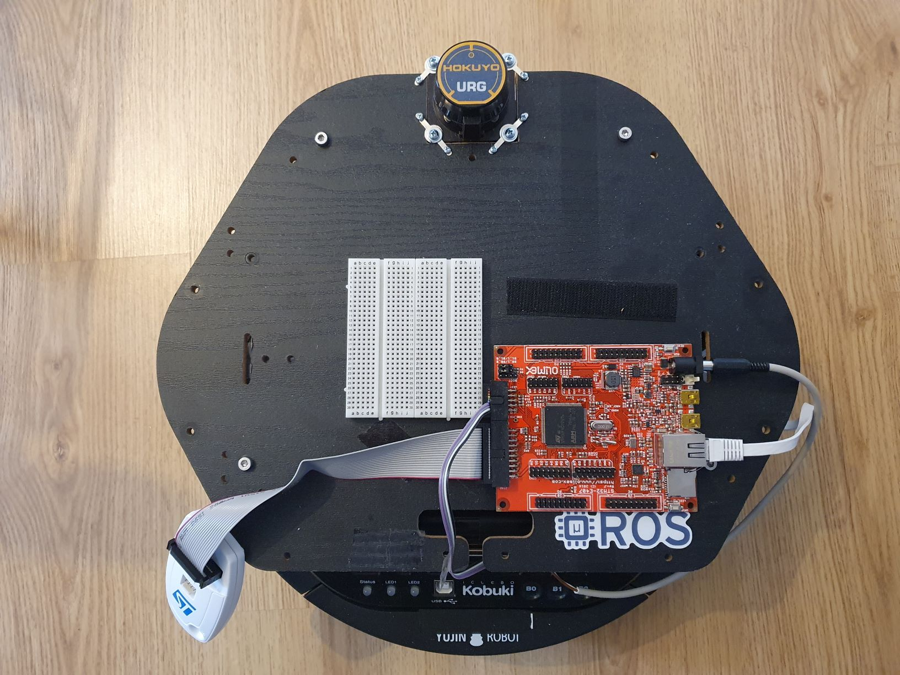
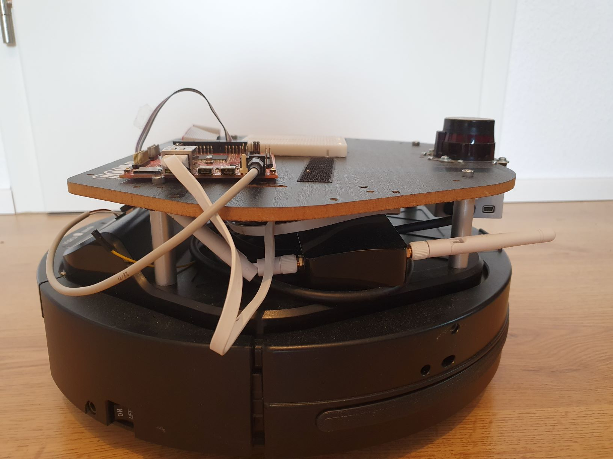

# Hardware setup for the Kobuki demo

### ChangeLog

 * 16th June 2020: Document stable setup with use of AP.
 * 11th October 2019: Documented basic setup, RTS/CTS still missing.

## Overview

On an abstract level, the following diagram depicts the components used and their connections

Note that the two Linux PC's (development and agent) may be the same physical machine, but don't have to be.

The main parts, from the perspective of Micro-ROS, are the robot and the Olimex STM32-E407 board. The WiFi Access-Point and the powerbank are just there to provide wireless networking, since the Olimex board doesn't have integrated WiFi.

On the real robot, the Olimex board is mounted on the top shelf, since we need to access it often. This is shown in the following photograph:

The access point and battery are placed on the bottom shelf. This is shown from the side in the next photograph:

## Part List

### Off-the-shelf parts
 
 * Turtlebot 2 base
 * Olimex STM32-E407 board with headers on "PD"
 * USB-OTG cable: Mini-AB to A
 * USB cable: A to B

### Custom parts

 * Serial cable between Kobuki base and Olimex board
    * DB25 male header
    * 3 wires
    * 
 * Power cable from Kobuki to Olimex board
    * Molex 43025-0208 connector
    * DC barrel jack for 2mm pin in 6.3mm hole, positive on pin
    

## Relevant Datasheets / Documentation

This tutorial is intended to be self-contained, but if you're interested in background, or find a problem, the following references might helpful.

### For the demo hardware

 * Kobuki ("Turtlebot 2") Robot
    * [User Guide with parallel port pinout](https://docs.google.com/document/d/15k7UBnYY_GPmKzQCjzRGCW-4dIP7zl_R_7tWPLM0zKI/edit#bookmark=id.jso1h9boryth)
 * Olimex STM32-E407
    * [Olimex STM32-E407 User Guide](https://www.olimex.com/Products/ARM/ST/STM32-E407/resources/STM32-E407.pdf)
    * [UEXT pinout](https://www.olimex.com/Products/ARM/ST/STM32-E407/resources/STM32-E407.pdf#15)
    * [PD pinout](https://www.olimex.com/Products/ARM/ST/STM32-E407/resources/STM32-E407.pdf#18)Start with 

## Communication Wiring

### Locations
 * *parallel* is the the Kobuki parallel port
 * *UEXT* is the extension connector on the Olimex STM32-E407 board (next to the JTAG)

### Connections

The following table lists the three connections needed:

|  Source  | SName  | Pin | Meaning | Dest | DName | Dest Pin |
|----------|--------|-----|---------|------|-------|----------|
| Parallel | GND    | 14  | Ground  | UEXT | GND   | 2        |
| Parallel | RX     | 1   | Serial  | UEXT | TX    | 3        |
| Parallel | TX     | 2   | Serial  | UEXT | TX    | 4        |
